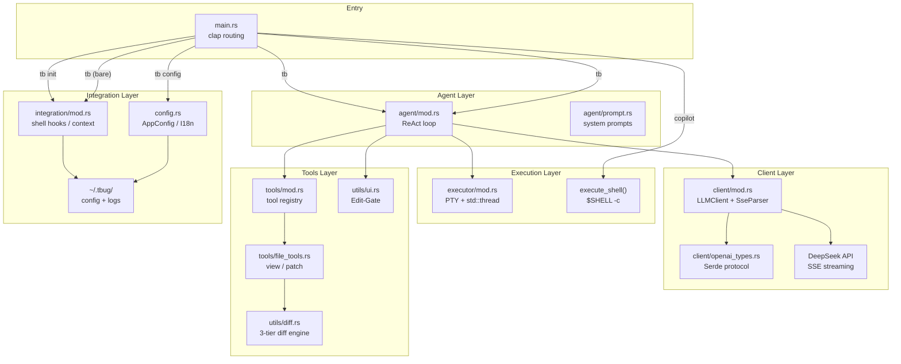
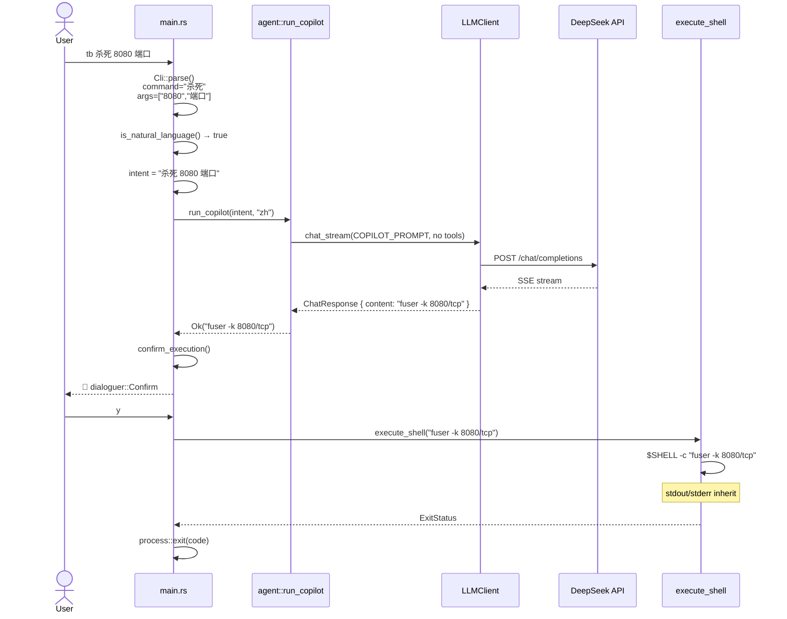
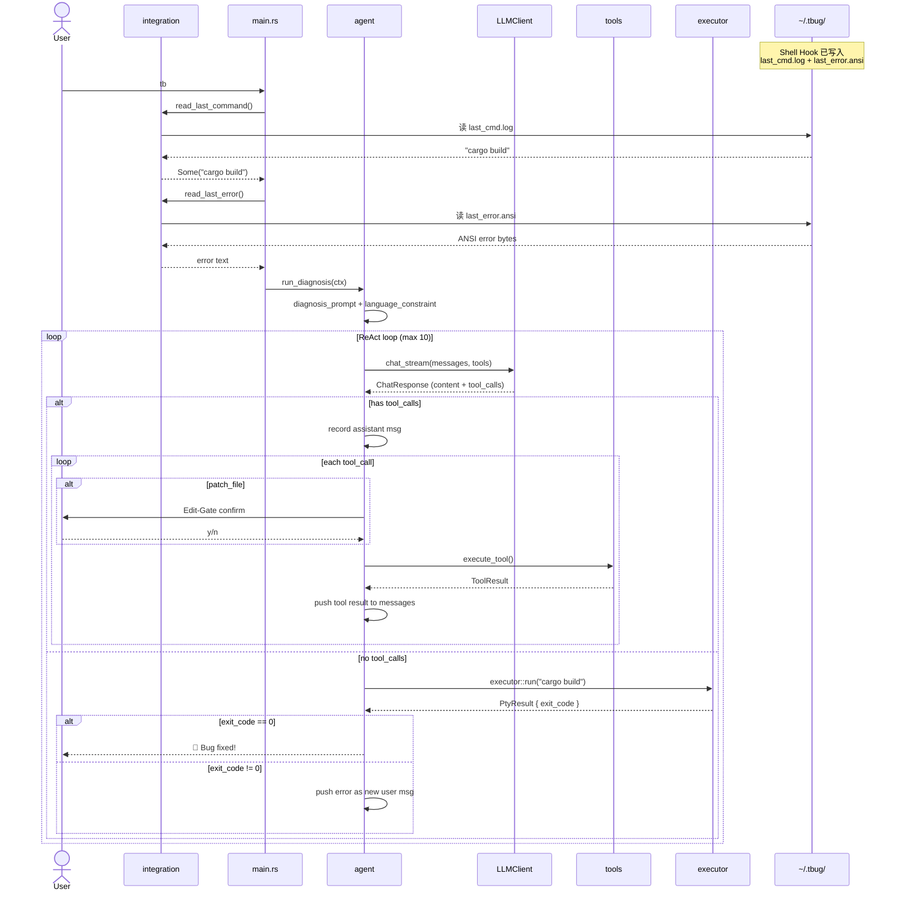
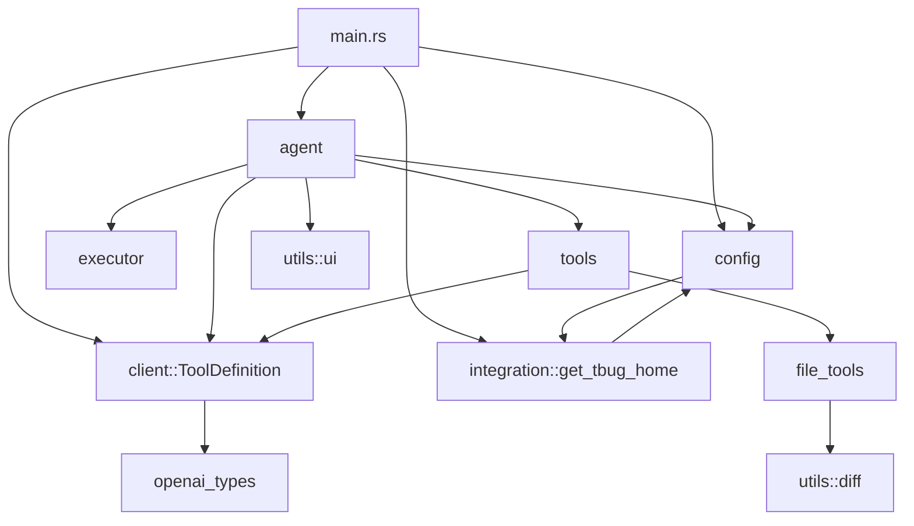

# tbug — Architecture & Technical Reference

> **Version** 0.1.0 | **Language** Rust (edition 2021) | **License** MIT

---

## 项目概览

### 项目用途

tbug 是一个 AI 驱动的自主调试助手。它捕获终端中失败命令的错误输出，调用
DeepSeek 大模型进行根因分析，通过文件查看/修补工具迭代修复，最后重新运行命令
验证修复效果。

### 解决的问题

开发者在终端中遇到编译错误、测试失败或运行时崩溃时，需要手动阅读错误、定位
源码、编辑修复、重新运行。tbug 将这一闭环全自动化：Shell Hook 被动词捕获错误
上下文，LLM 主动推理修复方案，Edit-Gate 做人机安全确认，PTY 做现场验证。

### 核心设计思想

- **ReAct (Reasoning + Acting)** — LLM 先思考（Thinking）再调工具（Acting），
  工具执行结果回灌消息队列，形成多轮闭环。
- **安全护栏** — 文件修改（`patch_file`）经过 Edit-Gate 人工确认；Copilot
  生成的系统命令经 Safety Gate 二次确认后才能执行。
- **关注点分离** — 四个独立层次：CLI 路由 → Agent 编排 → 执行器/客户端 →
  工具/工具引擎。每层通过明确的数据结构通信，无跨层耦合。
- **零外部运行时** — 单二进制，依赖纯 Rust 生态（tokio、reqwest、
  portable-pty、clap），无需 Node.js/Python/容器。

---

## 技术分析

### 技术栈

| 类别 | 选型 | 用途 |
| --- | --- | --- |
| 异步运行时 | tokio (full) | 网络 I/O、PTY channel、超时控制 |
| HTTP 客户端 | reqwest (stream + json) | DeepSeek API SSE 流式调用 |
| PTY | portable-pty 0.8 | 跨平台伪终端，stdout/stderr 合并捕获 |
| CLI | clap 4 (derive) | 子命令路由、尾随参数解析 |
| 序列化 | serde + serde_json | API 协议类型、配置文件持久化 |
| 错误处理 | anyhow | 全链路 `Result<T>` 传播 |
| 终端交互 | dialoguer | Select 菜单、Confirm 确认 |
| 环境变量 | dotenvy | `.env` 加载（手动解析覆盖语义） |

### 构建系统

```bash
cargo build --release    # 优化编译 → ./target/release/tbug
cargo test               # 113 个单元测试，< 1s 完成
cargo test -- <filter>   # 按名称筛选
cargo check              # 仅类型检查
```

### 模块划分

```
src/
├── main.rs              # CLI 入口、路由分发、Copilot 安全门
├── config.rs            # AppConfig 持久化、I18n 文案引擎
├── agent/
│   ├── mod.rs           # ReAct 循环编排、三个入口函数
│   └── prompt.rs        # SYSTEM_PROMPT / COPILOT_SYSTEM_PROMPT
├── client/
│   ├── mod.rs           # LLMClient、SseParser、.env 加载、单例
│   └── openai_types.rs  # OpenAI 兼容 Serde 协议类型（14 个 struct/enum）
├── executor/
│   └── mod.rs           # PTY 执行器（std::thread + mpsc 桥接）
├── tools/
│   ├── mod.rs           # 编译期工具注册表
│   └── file_tools.rs    # view_file / patch_file 处理器
├── utils/
│   ├── diff.rs          # 三级 SEARCH/REPLACE 差异引擎
│   └── ui.rs            # Edit-Gate 预览框 + dialoguer 确认
└── integration/
    └── mod.rs           # Shell Hook 注入、上下文收集、沙箱目录
```

### 生命周期

```
[Shell Hook 触发] → 写 last_cmd.log / last_error.ansi
         ↓
    用户键入 `tb`
         ↓
    main.rs 加载 config.json, .env
         ↓
    ┌─ tb init        → integration::init() → 注入 Hook → 退出
    ├─ tb config      → run_config() → Select 菜单 → 保存 → 退出
    ├─ tb (bare)      → read_last_command() → run_diagnosis() → ReAct 循环
    ├─ tb <command>   → run_agent() → PTY 试跑 → ReAct 循环
    └─ tb <natural>   → run_copilot() → Safety Gate → execute_shell()
```

---

## 深度分析

### 核心数据结构

#### `ChatMessage` (client/openai_types.rs)
```rust
pub struct ChatMessage {
    pub role: String,              // "system" | "user" | "assistant" | "tool"
    pub content: Option<String>,   // null when tool_calls present
    pub tool_calls: Option<Vec<ToolCall>>,
    pub tool_call_id: Option<String>,
    pub name: Option<String>,
}
```
OpenAI 兼容协议的消息载体。`content` 为 `Option` 是因为 OpenAI 约定：
当 assistant 消息包含 `tool_calls` 时 `content` 为 `null`。

#### `SseParser` (client/mod.rs)
```rust
struct SseParser {
    buffer: String,                         // 不完整行缓冲区
    content: String,                        // 聚合的文本增量
    tool_accums: HashMap<usize, ToolCallAccum>, // 按 index 分组的工具调用累加器
    usage: Option<Usage>,
}
```
解耦 HTTP 层的独立 SSE 解析器。核心设计：
- 字节分片跨 TCP chunk 拼接：不完整行留在 `buffer`，完整行交给
  `process_line()`
- 多路工具调用交叉到达时，按 `index` 分桶累加 `id`/`name`/`arguments`，
  不交叉污染

#### `PtyOptions` / `PtyResult` (executor/mod.rs)
```rust
pub struct PtyOptions {
    pub command: String,
    pub args: Vec<String>,
    pub cwd: Option<String>,
    pub env: Option<HashMap<String, String>>,
    pub timeout: Option<Duration>,
}

pub struct PtyResult {
    pub output: String,         // stdout + stderr 合并
    pub exit_code: i32,         // -1 = 超时强杀
    pub signal: Option<i32>,
}
```

#### `AppConfig` (config.rs)
```rust
pub struct AppConfig {
    #[serde(default = "default_language")]
    pub language: String,       // "zh" | "en"
}
```
持久化到 `~/.tbug/config.json` 的配置实体，内嵌 17 个 I18n 文案方法。

### 核心 Trait / Interface

项目不使用自定义 trait（编译期分发优先）。核心接口是函数签名约定：

```
┌──────────────────────┐
│ agent::run_agent()   │  接收 AgentOptions，返回 Result<()>
│ agent::run_diagnosis()│  接收 DiagnosisContext，返回 Result<()>
│ agent::run_copilot() │  接收 intent + language，返回 Result<String>
├──────────────────────┤
│ client.chat_stream() │  接收 messages + ChatOptions + on_event 回调
│ executor::run()      │  接收 PtyOptions + on_data 回调
│ tools::execute_tool()│  接收 tool_name + serde_json::Value args
├──────────────────────┤
│ diff::apply_delta()  │  接收 file_path + delta 字符串
│ ui::ask_user_confirmation()│ 接收 patch_args + language
│ integration::init()  │  接收 &AppConfig
└──────────────────────┘
```

LLM 返回的工具调用通过 `serde_json::Value` 传递参数，处理器内部用
`.get("path").and_then(|v| v.as_str())` 动态解析，容忍 LLM 参数怪癖。

### 调度流程

```
用户输入
  ↓
main.rs: Cli::parse()
  ↓
┌─ Subcommand? ──→ Init  ──→ integration::init()
│                ──→ Config──→ run_config()
│
└─ No subcommand
     ↓
   command?
     ├─ Some(cmd)
     │    ├─ args.is_empty() && is_ascii → agent::run_agent()
     │    └─ else                       → agent::run_copilot()
     │                                      → confirm_execution()
     │                                      → execute_shell()
     └─ None
          └─ read_last_command()
               ├─ Some → agent::run_diagnosis()
               └─ None → 打印 msg_no_context() → exit(0)
```

### ReAct 循环内部

```
run_react_loop(messages, command, args, working_dir, max_iters, language)
  │
  for i in 0..max_iters:
  │
  ├─[1] client.chat_stream(messages, tools, on_event)
  │      └─ 实时打印 Thinking / Content 到终端
  │
  ├─[2] 记录 assistant 消息 → push 到 messages
  │
  ├─[3] 有 tool_calls?
  │      ├─ YES → 遍历每个 tool_call
  │      │        ├─ patch_file? → ui::ask_user_confirmation()
  │      │        │    ├─ Reject → push tool("User rejected...")
  │      │        │    └─ Accept → tools::execute_tool() → push tool(result)
  │      │        └─ 其他工具 → tools::execute_tool() → push tool(result)
  │      │        → continue (回 LLM 继续思考)
  │      │
  │      └─ NO  → LLM 认为修复完成
  │               ├─[4] executor::run(command, args) 重跑原始命令
  │               ├─ exit_code == 0 → 打印成功 → return
  │               └─ exit_code ≠ 0 → push user(new_error) → 下一轮
  │
  └─ 达到 max_iters → 打印警告 → return
```

### I/O 流程

```
┌─────────────────────────────────────────────────┐
│                  Async Context (tokio)           │
│                                                  │
│  agent ──→ client.chat_stream() ──→ HTTP SSE    │
│    │                                      │      │
│    │                              bytes_stream() │
│    │                                      │      │
│    │                              SseParser::feed()
│    │                                      │      │
│    │                            on_event(delta)   │
│    │                                      │      │
│    └── print!() ←──────── Thinking/Content       │
│                                                  │
│  agent ──→ executor::run()                       │
│              │                                    │
│              ├─ mpsc::recv() ←──────┐            │
│              │                      │            │
│              └─ tokio::select!      │            │
│                   ├─ data_rx        │            │
│                   └─ timeout ──→ child.kill()    │
│                                  │               │
├──────────────────────────────────┼───────────────┤
│            std::thread           │               │
│                                  │               │
│  run_pty_blocking()              │               │
│    ├─ spawn child                │               │
│    ├─ read() loop ──→ mpsc::send()              │
│    ├─ child.wait()                               │
│    └─ write result → Arc<Mutex<Option<PtyResult>>>│
└─────────────────────────────────────────────────┘
```

关键同步原语：
- **`mpsc::unbounded_channel`** — 数据管道：`Sender` 在 `std::thread`，
  `Receiver` 在 `tokio` 上下文
- **`Arc<Mutex<Option<Child>>>`** — 子进程句柄共享：线程写入，async 超时路径
  取出并 `kill()`。`Option` 的 `take()` 语义确保只 kill 一次
- **`Arc<Mutex<Option<PtyResult>>>`** — 结果共享：线程在所有 `return` 点
  通过 `finish()` 闭包写入结果后再 `drop(data_tx)`，消除竞态

### 错误处理机制

项目采用 **anyhow** 全链路错误传播：

```
fn foo() -> anyhow::Result<T> {
    let x = fallible_op().context("附加语义")?;
    Ok(x)
}
```

分层策略：
- **系统边界**（client、executor、integration）：`anyhow::Result`，
  使用 `.with_context()` 附加文件路径/命令名
- **工具处理器**（file_tools）：返回 `ToolResult { success: bool, content: String }`，
  LLM 通过 `content` 文本理解错误
- **main.rs**：`if let Err(e) = ... { eprintln!("Fatal: {}", e); process::exit(1); }`
- **`.unwrap()` 禁止**：仅在 `OnceLock::get_or_init`（初始化逻辑保证成功）和
  `Mutex::lock().unwrap()`（中毒即不可恢复）两处使用

---

## Rust 特性

### Ownership 设计

- **零拷贝差异引擎**：`diff::Block<'a>` 持有 `&'a str` 借用切片，
  `locate_match()` 全程操作引用，仅在 `apply_delta()` 最终写入时分配新
  `String`
- **move 语义保护**：`path_owned` 移入 `spawn_blocking` 闭包前克隆
  `path_for_msg`，编译器在编译期防止 use-after-move
- **`Arc<Mutex<T>>` 共享所有权**：子进程句柄和结果在两个线程间共享，
  `Arc` 提供引用计数，`Mutex` 提供内部可变性

### Async 模型

```
tokio::main                    ← 多线程运行时
  ├─ agent::run_react_loop     ← async fn，.await 点切换
  │    ├─ client.chat_stream() ← HTTP SSE 流，.await 释放线程
  │    ├─ tools::execute_tool()
  │    │    └─ spawn_blocking  ← 文件 I/O 不阻塞 async 线程
  │    └─ executor::run()
  │         ├─ mpsc::recv().await ← 异步等待线程数据
  │         └─ tokio::select!     ← 并发等待数据/超时
  └─ agent::run_copilot()         ← 无工具调用，单次流式请求
```

### Trait 架构

项目刻意不使用自定义 trait 对象。工具调度使用**编译期 `match` 分发**：

```rust
pub async fn execute_tool(name: &str, args: &Value) -> ToolResult {
    match name {
        "view_file" => file_tools::view_file(args).await,
        "patch_file" => file_tools::patch_file(args).await,
        other => ToolResult::err(format!("Unknown tool: \"{}\"", other)),
    }
}
```

优势：零虚函数开销，编译器可内联，新增工具仅需加一个 match 分支 + 常量字符串。

### 静态初始化

```rust
// LLMClient 单例
static DEFAULT_CLIENT: OnceLock<LLMClient> = OnceLock::new();

// 工具定义缓存
static CACHE: OnceLock<Vec<ToolDefinition>> = OnceLock::new();
```

`OnceLock` 提供 lazy-init 线程安全单例，替代 `lazy_static!` 宏，是标准库
原生方案。

### Unsafe 使用

**零 unsafe 代码。** 整个项目不包含任何 `unsafe` 块。线程安全通过标准库
同步原语保证（`Mutex`、`Arc`、`mpsc`、`OnceLock`），FFI 通过
`portable-pty` 封装。

---

## 图表

### Mermaid 架构全景图



### 调用链图（Copilot 模式）



### 调用链图（诊断模式）



### 模块依赖树



依赖方向严格遵循 **上层依赖下层，同层不相依**：
- `main.rs` → 所有模块（编排层）
- `agent` → `client`, `executor`, `tools`, `utils`, `config`（调度层）
- `tools` → `utils::diff`（工具层）
- `client` → 仅第三方 crate（网络层）
- `integration` → `config`（集成层）

### 项目阅读路线

**推荐阅读顺序（由底向上）：**

```
1. src/client/openai_types.rs    — 协议类型，无依赖，理解数据结构
2. src/client/mod.rs             — SSE 解析 + LLM 客户端，理解网络层
3. src/utils/diff.rs             — 差异引擎，算法核心
4. src/utils/ui.rs               — Edit-Gate 界面
5. src/tools/file_tools.rs       — 工具处理器
6. src/tools/mod.rs              — 工具注册表
7. src/executor/mod.rs           — PTY 异步桥接
8. src/config.rs                 — 配置 + I18n
9. src/integration/mod.rs        — Shell Hook 注入 + 上下文收集
10. src/agent/prompt.rs          — System Prompt 定义
11. src/agent/mod.rs             — ReAct 循环编排（全栈缝合点）
12. src/main.rs                  — CLI 入口（路由总控）
```

每步均可独立编译测试（`cargo test -- <module>`），不依赖外部服务。
